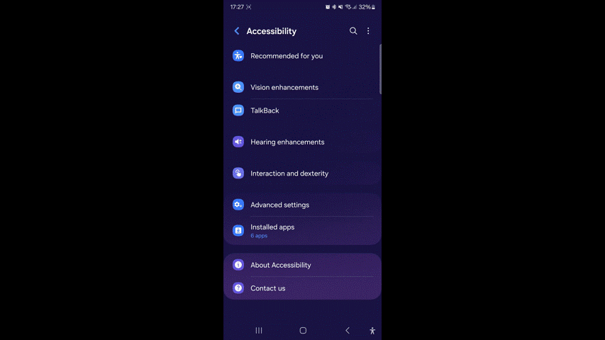

# Project Orion
### Open-Source Screen Reader using Gemini AI

Orion is a screen reader designed to make Android devices more accessible by using Gemini AI. It works as an accessibility service, letting users convert on-screen content into spoken words easily. With a floating button called **Read Screen**, Orion allows users to hear information on their screens with just a tap.

## Features
- **Accessibility Service Integration**: Works as an accessibility service to provide screen reading capabilities.
- **Hover Button**: A floating button labeled **Read Screen** for easy access.
- **AI-Powered**: Captures a snapshot of the current screen, sends it to Gemini AI, and reads the result aloud.
- **Custom Configuration**: Easily configure settings by visiting a specific website to get an API token.

## Addressing Accessibility

Orion is designed to help people with visual impairments or blindness access their smartphone screens more easily. Accessing information from a screen can be challenging for users with limited or no vision, and Orion aims to make this process simple. Here are some key ways Orion helps:

- **Screen Content Read-Aloud**: Orion reads out any text or relevant information on the screen, making it easy to understand content without seeing it.
- **Simple Floating Button**: The **Read Screen** button is easy to locate and use. Users just tap the button to access the content, making navigation more straightforward.
- **AI-Powered Context Extraction**: Orion, powered by [Gemini AI](https://gemini.google.com/), goes beyond reading text. It summarizes relevant information from the screen and skips unnecessary parts, helping users focus on what matters most.
- **Tactile Feedback**: Vibrations provide feedback when interacting with the **Read Screen** button, helping blind users know their action was successful.
- **Customizable Settings**: Users can adjust the settings, such as the speed and pitch of the voice, to make it more comfortable and easy to understand.

The main goal of this project is to support users who have difficulty accessing content on apps or websites that overlay content with popups or other interactive elements.

Orion bridges the accessibility gap, helping visually impaired individuals interact more easily with their Android devices. By combining advanced AI with a simple user interface, Orion gives users more independence in their daily digital activities.

## How It Works
1. **Accessibility Service**: After installing the app, Orion works as an accessibility service to get the needed permissions.
2. **Floating Button Activation**: The **Read Screen** button floats over your device screen.
3. **Screen Capture**: When the user taps the button, Orion takes a snapshot of the current screen.
4. **AI Processing**: The snapshot is sent to Gemini AI, which extracts meaningful information.
5. **TTS Output**: The processed information is read aloud using Text-To-Speech (TTS), giving users an audio overview of the screen's content.

## Getting Started

### Prerequisites
- **Android Device**: Orion works with Android versions that support accessibility services.
- **Internet Connection**: Orion needs a stable internet connection to process snapshots using Gemini AI.

### Installation
1. **Download**: Install the Orion APK on your Android device.
2. **Accessibility Permissions**: Enable the accessibility service for Orion via Settings to allow screen reading.
3. **API Token Setup**: Go to the [Google AI Studio](https://aistudio.google.com/app/apikey) to get your free API Token.

### Permissions Required
The app needs the following permissions to work:
- **Vibrate** (`android.permission.VIBRATE`): To provide feedback when buttons are pressed.
- **Foreground Service** (`android.permission.FOREGROUND_SERVICE`): To capture screen content.
- **System Alert Window** (`android.permission.SYSTEM_ALERT_WINDOW`): To display the floating **Read Screen** button.
- **External Storage** (`android.permission.READ_EXTERNAL_STORAGE` and `android.permission.WRITE_EXTERNAL_STORAGE`): To store and read screen captures.

## Usage
1. Tap the **Read Screen** button, which floats over your screen.
2. Orion captures a snapshot of the visible screen.
3. The content is processed by Gemini AI to generate meaningful information.
4. The result is read aloud using the device's Text-To-Speech (TTS) function.

## Google API Key

## Development
### Code Overview
- **AndroidManifest.xml**: Declares required permissions and components, including activities and services.
- **MyAccessibilityService.kt**: Implements the core functionality for screen content accessibility.
- **ScreenCaptureActivity.kt**: Manages screen capture when triggered by the floating button.
- **ScreenCaptureForegroundService.kt**: Handles foreground tasks related to screen capture.
- **SettingsActivity.kt**: Provides the UI for configuring app settings.

### Build
To build the project, use Android Studio and make sure all permissions are declared correctly in `AndroidManifest.xml`.

## Contributing
Contributions are welcome! Please fork the repository, create a feature branch, and submit a pull request for review.

## License
This project is licensed under the MIT License - see the [LICENSE](LICENSE) file for details.

## Contact
For questions or support, please reach out at [archudzik@gmail.com](mailto:archudzik@gmail.com).

If you are not technical and would like to test this application, please drop me an email.
